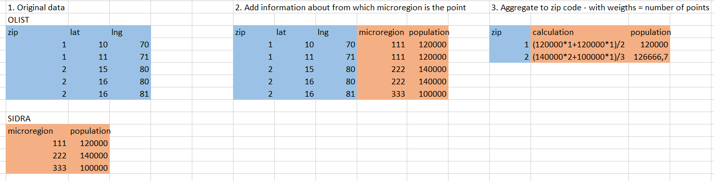

```{r setup, include=FALSE}
knitr::opts_chunk$set(echo = TRUE)
```

#### TODO

Opis obu źródeł danych

- OLIST

- Linki do stron
- Kiedy pobrane
- Za jaki okres
- że Brazylia

Jakie dane w obu źródłach

- typy danych
- ile obserwacji
- jak przetwarzane
- które obserwacje brane
- sposób utworzenia zmiennej zależnej


Analiza if_second_order

- że 97% (?) klientów nie kupuje drugi raz
- że 50% klientów kupuje max do miesiąca po ostatnim zakupie (tabela z kwantylami?)
- że większa szansa przejść z 2 do 3 niż z 1 do 2

#### Olist

TODO: Opis firmy w oderwaniu od datasetu

- (https://www.kaggle.com/olistbr/brazilian-ecommerce access 14.03.2020)
- The dataset was published by the company for public use
- Contains information about 100 thousand orders made on the e-commerce shop site from 2016 to 2018
- Very rich dataset - contains information about the order, customer and review

##### Opis zmiennych po kolei

In particular, there were 96180 transactions (96%) from the customers that never previously bought in this shop. 

In this study I am mostly interested in analysing these transactions, and trying to predict just after first transaction, if the customer is likely to buy second time. Changing the customer attitude after buying for the second time is out of the scope of this study. One reason is the lack of data to properly conduct modeling. The other is that usually making customer buy for the second time is the hardest. In particular in this e-commerce store, in the group of the customers that bought for the first time, only 3.2% of them will buy for the second time. However, in the group of the customers that already bought for the second time, 8.6% will buy third time. The same measure is 18.7% for going from third to fourth time. This is a proof that the very first step of retaining the customer is the most important one, and further it is easier and easier to stop the churn.


The primary key in the dataset in the case of almost all features is order number. However, as in the final dataset I'm including the full information only about the first order of each customer, one observation is equal both to one order and one customer. 

The Olist dataset has the following features groups:

- payment value transportation value - value of the order in Brazilian Reals excluding the transportation cost
- number of items the customer bought in particular order
- review of the order - after the finished order the customer can provide the review of the order in 2 forms - 1-5 score or textual review. In the dataset codebook the authors stated that not all of the customers in real life put any review, but this dataset was sampled in such a way that the records without 1-5 review were excluded. On the contrary, the textual review is filled only in ~50%. The data about 1-5 review can be included to the models as-is. Textual review requires however more intense preprocessing, which is described in the *methods* section of this study.
- location of the customer - the main table containing customer information contains 5-digit ZIP code of the customer's home. The company provided also a mapping table, in which each ZIP code is assigned to multiple latitude/longitude coordinates. Probably this was done because of anonimisation reasons - so that one cannot connect the customer from the dataset with the exact house location. To obtain an exact one-to-one customer-geolocation mapping, to each zip code, I have assigned the most central geolocation from the mapping table. To obtain the most central point, I have used Clustering Around Medoids algorithm with only one cluster, and ran the algorithm separately for each ZIP code. 
- products bought - the dataset contains information about how many items there were in the package, as well as product category of each item - in the form of raw text. In total there were ... categories, but the top .. accounted for ... of all the purchases. To limit the number of the variables for the modeling process, I have decided to change the label of all the least popular categories to "others".

#### SIDRA:

The dataset about the population statistics was obtained from Instituto Brasileiro de Geografia e Estatística web service called SIDRA (https://sidra.ibge.gov.br/tabela/3548 access 26.09.2020). In this study I have used the data obtained from 2010 general census. The dataset is avaliable in aggregation to microregions (a Brasilian administrative unit, it has similar level of aggregation to NUTS 3 european classification). 558 microregions were avaliable. In particular, I have chosen the following 36 variables from the dataset:

- total population of the microregion - 1 variable
- age structure - percentage of people in particular age bin (with the width of the bins equal to 5 years) - 20 variables
- percentage of people living in rural areas and urban areas - 2 variables
- percentage of immigrants compared to total microregion population - 1 variable
- earnings structure - share of the people that earn between x0\*minimum_wage and x1\*minimum_wage - 11 variables

#### Joining of the 2 data sources

Joining of the data coming from SIDRA and OLIST sources proved to be challenging. There were multiple reasons for that:

- In e-commerce dataset the spatial dimansion is decoded mainly in a form of ZIP codes, while in demographic dataset - in a form of microregions.
- The boundaries of zipcodes and microregions do not align.
- The geoloacation data from OLIST has 3 columns - zip code and lat/lng coordinates. For each zip code are multiple entries for coordinates. This probably means that the company has exact coordinates of each of their customers, but decided to not provide exact customer-location mapping in public dataset for anonimisation reasons. Because of that the boundaries of zip codes cannot be specified exactly and one has to rely on the particular points from this zipcode area.

My approach was as follows: 

1. For each of the points in OLIST geolocation dataset, establish in which microregion it is. Join the dataset for that region to OLIST geolocation dataset.
2. Group the dataset by zip code and calculate the mean of each of the features in the dataset. In this case this mean would be a weighted mean (with weight in form of "how many customers are in this area?")



(TODO: Zrobić tabelki w R a nie w excelu, pewnie też lepiej opisać)


## Do methods description

Opisać one-hot encoding kategorii produktów 


