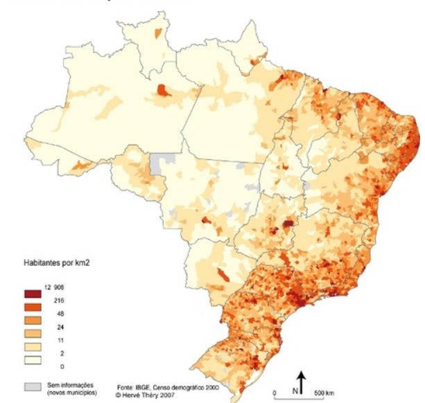

```{r include=FALSE}
knitr::opts_chunk$set(message = F, warning = F, echo=params$echo, fig.width = 4, fig.height = 2)
```


<!-- TODO: *W części 03 przydadzą się ilustracje jak wygląda zbiór danych, statystyki zmiennych etc + solidne mapowanie. Rzeczywiście ostatnia mapa chyba ciekawiej może wyglądać jako grid (dałabym obie). Zupełnie brakuje prostych statystyk sprzedażowych zwizualizowanych na mapie (jako grid): ilu klientów, ile transakcji, wartość transakcji - w ujęciu nominalnym, ale też w odniesieniu do populacji (żeby lepiej rozumieć rozkład transakcji i klientów) + jego density (w gglot można zrobić kernel density punktów i zmapować).* -->

## Data sources

In this study, I have used data from 2 sources. The main one is e-commerce store transactions data. Olist company is operating in Brazil, and the dataset was made available online for public use^[https://www.kaggle.com/olistbr/brazilian-ecommerce ; access 14.03.2020]. The other source is census data obtained from the Brazilian Statistical Office^[https://sidra.ibge.gov.br/tabela/3548 access 26.09.2020].

### Transaction dataset

The Olist company dataset contains information about 100 thousand orders made on the e-commerce shop site from 2016 to 2018. Besides technical variables indicating keys to join multiple tables from the dataset, it also contains the following features groups:

- payment value - the value of the order in Brazilian Reals 
- transportation value
- number of items the customer bought in a particular order
- review of the order - after the finished order the customer can provide the review of the order in 2 forms - 1-5 score or textual review. In the dataset codebook, the authors stated that not all of the customers in real life put any review, but this dataset was sampled in such a way that the records without 1-5 review were excluded. On the contrary, the textual review is filled only in ~50%. The data about 1-5 review can be included in the models as-is. The textual review requires however more advanced preprocessing, which is described in the *methods* section of this study.
- location of the customer - the main table containing customer information contains the 5-digit ZIP code of the customer's home. The company provided also a mapping table, in which each ZIP code is assigned to multiple latitude/longitude coordinates. Probably this was done because of anonymization reasons - so that one cannot connect the customer from the dataset with the exact house location. To obtain an exact one-to-one customer-geolocation mapping, to each zip code I have assigned the most central geolocation from the mapping table. To obtain the most central point, I have used the Clustering Around Medoids algorithm with only one cluster and ran the algorithm separately for each ZIP code. 
- products bought - the dataset contains information about how many items there were in the package, as well as the product category of each item - in the form of raw text. In total there were 74 categories, but the top 15 accounted for 80% of all the purchases. To limit the number of variables for the modeling process, I have decided to change the label of all the least popular categories to "others".

The main goal of this study is to try to predict just after the first transaction if the customer is likely to buy for the second time. 
**In the dataset there were 96180 transactions (96.6%) from the customers that never previously bought in this shop. **

### Geodemographic dataset

The dataset about the population statistics was obtained from Instituto Brasileiro de Geografia e Estatística web service called SIDRA. In this study, I have used the data obtained from the 2010 general census. The dataset is available in aggregation to microregions (a Brazilian administrative unit, it has a similar level of aggregation to NUTS 3 European classification). 558 microregions were available. In particular, I have chosen the following 36 variables from the dataset:

- total population of the microregion - 1 variable
- age structure - a percentage of people in a particular age bin (with the width of the bins equal to 5 years) - 20 variables
- percentage of people living in rural areas and urban areas - 2 variables
- percentage of immigrants compared to total microregion population - 1 variable
- earnings structure - share of the people that earn between x0\*minimum_wage and x1\*minimum_wage - 11 variables

TODO: Czy dodać też mapki/wykresy z tymi zmiennymi? To trochę trudne bo jest ich sporo które oznaczają jedną informację.


## Quantitative analysis

### Univariate analysis

```{r cache=F}
library(readr)
library(tidyverse)
library("leaflet")
library(psych)
library(lubridate)
library(cluster)
library(factoextra)
library(caret)
library(rpart)
library(DALEX)
library(stringr)
library(sf)
library(tmap)
library(here)
library(readxl)
```

```{r}
custom_theme <- theme_minimal() +
  theme(axis.title = element_text(size=9),
        legend.title = element_text(size=9)
  )
```


```{r cache=T}
load(here('run_all_models_cache/to_model_train.Rdata'))
load(here('run_all_models_cache/to_model_test.Rdata'))
  
vars_basic <- c("payment_value", "review_score", "geolocation_lat", 
                "geolocation_lng",
                "no_items", "sum_freight")

df <- to_model_train[c(vars_basic, 'if_second_order')]
```

<!-- #### Dependent variable -->

In table ... statistics about customer's orders divided by sequential order number are presented. In the whole dataset, 96 thousand orders were the customer's first order. Then, the number of orders falls abruptly, and there are only 47 orders in the dataset that were customer's 5th or later order.
The mean value of the transaction does not change with the order number. This means that if the company can make the customer place a second order, it would gain about the same revenue as from the customer's first order. 
In the last column, percentages of stage-to-stage movement are presented. For example, the probability that customers who bought one time will also buy a second time is 3%. The same value, but from second to third order is 8.5%. This means that encouraging the customer to buy for the second time is the hardest task the company faces. With the next purchases, the customers are becoming more and more loyal.

```{r}
load(here('data/05_dependent_var_stats.Rdata'))

dependent_var_stats %>%
  mutate(mean_payment = sprintf('%.0f', mean_payment),
         percent = ifelse(is.na(percent), '-', sprintf('%.2f%%',percent*100))
         ) %>%
  rename(
    `Order number` = order_no,
    `No. of orders` = no_orders,
    `Mean value` = mean_payment, 
    `Proportion from previous stage` = percent
  ) %>%
  flextable::flextable() %>%
  flextable::set_caption("Sequential orders analysis") %>%
  flextable::font(fontname = 'Times New Roman', part = 'all') %>%
  flextable::fontsize(size = 12) %>%
  flextable::autofit()


```

<!-- #### Payment value, transportation cost -->

On the plot \@ref(fig:payment-transportation) the density estimation of the values of payment (left) and transport (right) for each order are presented. I have used the Kernel Density Estimation technique to smoothen the plots. As the distribution is highly right-skewed, I have logarithmed the values. The density plot is grouped by the fact whether the particular customer also placed a second order later. It can be seen that for both variables the 2 densities almost overlap. This means that payment value and transportation cost probably would not be good predictors in a univariate approach - although maybe they can be interacted with other features and start having predictive power.

```{r payment-transportation, cache = T, fig.cap='Payment value and transportation cost. x-axis is log-transformed.', fig.width = 6, fig.height = 2}
df %>% 
  ggplot(aes(x =payment_value, fill= if_second_order)) +
  geom_density(alpha=0.5) +
  scale_x_log10() +
  custom_theme +
  theme(legend.position = 'none') +
  labs(x = 'Payment value') +
  scale_fill_brewer(palette = 'Set1') -> pl_payment

df %>% 
  ggplot(aes(x = sum_freight, fill=if_second_order)) +
  geom_density(alpha=0.5) +
  scale_x_log10() +
  custom_theme +
  labs(x = 'Transportation cost') +
  scale_fill_brewer(palette = 'Set1') -> pl_transportation

gridExtra::grid.arrange(pl_payment, pl_transportation, ncol = 2, widths = c(1,1.7))
```

An interesting thing to check is whether the value of the ordered products and the transportation cost are correlated. Pearson correlation between these two is `r sprintf('%.3f', cor(select(df, payment_value, sum_freight))[1,2])`, meaning that the value of the items ordered somehow influences the rest of the costs. I have also plotted these two against each other on the figure \@ref(fig:payment-transportation-corr). Again, I have logarithmed both axes. 

```{r payment-transportation-corr, cache=T, fig.cap='Scatterplot of transportation value and order value. Both axes are logarithmed for better plot clarity.', fig.width = 3, fig.height = 3}
df %>%
  sample_frac(0.1) %>%
  ggplot(aes(y = sum_freight, x = payment_value)) +
  geom_point(alpha = 0.1) +
  geom_abline(slope = 1, intercept = 0) +
  scale_x_log10() +
  scale_y_log10() +
  custom_theme +
  labs(x = 'Payment value', y = 'Transportation cost')
```

The relationship is very clear here. For the particular value of the package, the transportation fee is seldom bigger than the value itself. I have added a line with a slope of 1 to highlight that. This probably comes from the company's policy - that it limits transportation cost on purpose because customers wouldn't buy the company's products if the transportation would cost more than the product itself. 

<!-- #### Review score -->

On the plot \@ref(fig:review-score) percentages of orders that were given x stars in the review are shown. On the right subplot percentages of the customers that made a second order are presented. Most of the reviews are positive - the scores 4 and 5 make up for 75% of the whole dataset. Another thing worth noticing is the tendency to the negative score polarization - if the customer is unsatisfied with the order, it is more likely for her to give the lowest review. 

```{r review-score, cache=T, fig.cap = 'Number of orders grouped by 1-5 review of the purchase (left) and percentage of such orders that resulted in second order (right).'}

df %>%
  filter(if_second_order=='yes') %>%
  group_by(review_score) %>%
  tally(name = 'cnt_second_order') -> tmp1


ggplot(df, aes(x = review_score)) +
  geom_bar(aes(y = (..count..)/sum(..count..))) +
  labs(y = 'Percentage in the dataset') + 
  coord_flip() +
  custom_theme +
  labs(x = 'Review score') +
  scale_y_continuous(n.breaks = 5,labels = scales::percent_format(accuracy = 1)) -> pl1


df %>% 
  group_by(review_score) %>%
  tally() %>%
  left_join(tmp1) %>%
  mutate(percent_second_order = cnt_second_order/n) %>%
  ggplot(aes(x = review_score, y = percent_second_order)) +
  geom_col() +
  coord_flip() +
  custom_theme +
  labs(y = 'Percentage of second order') +
  scale_y_continuous(n.breaks = 5,labels = function(x) sprintf('%.1f%%', x*100)) -> pl2

gridExtra::grid.arrange(pl1, pl2, ncol=2)

```

The relationship between making a second order and the review score for the first one is somehow surprising. One would expect that if the client is unsatisfied for the first time, she will never buy in this store again. In the case of this dataset, it is the opposite - the customers that gave one-star reviews are also the most likely to make the second order. It is worth noting is that the differences between the groups are very small - between 2.9% for review 4 (smallest one), and 3.45% for review 1. One can wonder if this can come simply from random reasons, and that the review score does not influence the probability to come back at all. In particular, the difference between the percentages for the scores 1 and 5 (0.003%) is that small that it is most likely for random reasons.

<!-- #### Items - numbers and percentage -->

On the plot \@ref(fig:items-numbers), analysis of the number of items in the order is presented. I have binned all orders with the number of items more than 4 to one category. On the left subplot is shown the percentage share in the full dataset, while on the right one - percentage of the customers that put second order after ordering x items for the first time.

```{r items-numbers, cache=T, fig.cap='Number of items in an order (left) and percentage of orders that resulted in second order grouped by the number of items (right).'}
# less than 7 - 99.7% of orders

df %>%
  mutate(no_items = ifelse(no_items<5, no_items, 5))%>%
ggplot(aes(x = no_items)) +
  geom_bar(aes(y = (..count..)/sum(..count..))) +
  scale_x_reverse(labels = function(x) ifelse(x ==5, '>4', x))+
  coord_flip() +
  custom_theme +
  labs(y = 'Percentage of orders', x = 'No. of items') +
  scale_y_continuous(n.breaks = 5, labels = function(x) sprintf('%.0f%%', x*100)) -> pl1

df %>%
  filter(if_second_order=='yes') %>%
  group_by(no_items) %>%
  tally(name = 'cnt_second_order') -> tmp2


df %>% 
  mutate(no_items = ifelse(no_items<5, no_items, 5))%>%
  group_by(no_items) %>%
  tally() %>%
  left_join(tmp2) %>%
  mutate(percent_second_order = cnt_second_order/n) %>%
  ggplot(aes(x = no_items, y = percent_second_order)) +
  geom_col() +
  scale_x_reverse(labels = function(x) ifelse(x ==5, '>4', x))+
  coord_flip() +
  custom_theme +
  labs(x = 'No. of items', y = 'Percentage of second order') +
  scale_y_continuous(n.breaks = 5,labels = function(x) sprintf('%.1f%%', x*100)) -> pl2

gridExtra::grid.arrange(pl1, pl2, ncol=2)

```

A trend is visible - the more items the customer has bought in the first order, the more likely she is to also put the second order. This difference is pretty strong - between 1 and 4 items the percentage increase in the response is 100%. For more items than 4, this relation is not visible anymore, however, these orders make up for a very small percentage of the dataset.

<!-- #### Product categories -->

In the table .., summary statistics about product categories are presented. The most popular category, "bed, bath and tables" accounts for 12% of all items bought in the shop. The table is ordered by the percentage of the customers that in first purchase bought particular category and later decided to buy in the shop for the second time. The difference in the percentages is visible. For "the best" category, it is 13.8%, while for the worst one - only 1.3%. This is a very promising result and a signal that the dummy variables indicating product category can serve as important features in the modeling phase. 

```{r}
to_model_train %>%
  select_at(vars(starts_with('prod_cat'), if_second_order)) %>%
  group_by(if_second_order) %>%
  summarise_if(is.numeric, mean) %>%
  filter(if_second_order =='yes') %>%
  pivot_longer(2:16) %>%
  select(-if_second_order) %>%
  mutate(category = str_replace(name, 'prod_cat_', '')) %>%
  rename(percent_second_order = value) %>%
  select(category, percent_second_order) -> product_categories_temp2

to_model_train %>%
  select_at(vars(starts_with('prod_cat'), if_second_order)) %>%
  # nie wiem dlaczego ale niektóre prod categories nie byłY 0,1
  mutate_if(is.numeric, function(x) ifelse(!(x %in% c(0,1)), 1, x)) %>% 
  summarise_if(is.numeric, sum) %>%
  pivot_longer(1:15) %>%
  mutate(category = str_replace(name, 'prod_cat_', '')) %>%
  rename(no_items = value) %>%
  mutate(percentage = no_items/sum(no_items)) %>%
  select(category, no_items, percentage) -> product_categories_temp1

product_categories_temp1 %>%
  left_join(product_categories_temp2) %>%
  arrange(-percent_second_order) %>%
  mutate_if(is.numeric, round,3) %>%
  mutate_at(vars(starts_with('perc')), ~sprintf('%.1f%%', .x*100)) %>%
  rename(
    `Product category` = category,
    `No. items` = no_items,
    `Percentage` = percentage,
    `Percentage of\n second order` = percent_second_order
  ) %>%
  flextable::flextable() %>%
  flextable::set_caption("Product categories") %>%
  flextable::font(fontname = 'Times New Roman', part = 'all') %>%
  flextable::fontsize(size = 12) %>%
  flextable::autofit()


```

### Spatial analysis

In the picture below, a map of Brazil's population density is presented^[source: https://www.gifex.com/detail2-en/2018-12-15-15407/Population_density_of_Brazil.html]. The most densely populated areas are located in the Southern part of the country. There, also the biggest cities like São Paulo and Rio de Janeiro are located. Another populated area is on the Eastern coast. The north-western part of the country is the least populated. The distribution of the customers follows this density very closely (with a correlation of 93%), that is why I did not include the map of customers density.


<!-- {width=4, height=2} -->

```{r out.width=300, out.height=300, }

```

On the maps in the figure \@ref(fig:maps-stats), basic statistics about the spatial distribution of the features are presented - in aggregation to microregion level. Such binning is relatively coarse - because of that, some of the statistics can be not reliable in the regions with a very small number of customers. That is why I have decided to remove from the map these microregions, in which the number of customers was less than 5. 


```{r cache=T}


tmap_mode("plot")
brazil_map <- brazilmaps::get_brmap("Brazil")

df = df[df$geolocation_lat <= 5.27438888,]
df = df[df$geolocation_lng >= -73.98283055,]
df = df[df$geolocation_lat >= -33.75116944,]
df = df[df$geolocation_lng <=  -34.79314722,]


df_map <- sf::st_as_sf(df %>% sample_n(10000), coords = c(4,3))
df_map <- sf::st_as_sf(df, coords = c(4,3))
st_crs(df_map) <- st_crs(brazil_map)

df_map %>%
  mutate(size=ifelse(if_second_order=='yes', 1, 0.4)) -> df_map
```

```{r}
# Load the cities coords

brasil_cities_coords <- read_excel(here("data/brasil_cities_coords.xlsx"))
brasil_cities_coords <- brasil_cities_coords %>%
  select(city, lat, lng, population)


brasil_cities_coords <- sf::st_as_sf(brasil_cities_coords, coords = c(3,2))
st_crs(brasil_cities_coords) <- st_crs(brazil_map)

```


```{r cache=T}
# prepare dataset

load(here('data/preprocessed/spatial_all.Rdata'))
# microregion_map <- brazilmaps::get_brmap("City")
load(file=here('data/microregion_map.Rdata'))

microregion_map = st_transform(microregion_map, 4326)

microregion_map1 = st_transform(microregion_map, st_crs(df_map))


# Punkt - region
intersection <- st_intersection(y = microregion_map1 %>% select(MicroRegion) , x = df_map)

# statsy per region
intersection %>%
  st_set_geometry(NULL) %>%
  group_by(MicroRegion) %>%
  summarise(
    no_customers = n(),
    mean_payment_value = mean(payment_value),
    sum_payment_value = sum(payment_value),
    median_payment_value = median(payment_value),
    mean_review_score = mean(review_score)
  ) -> stats_per_microregion


intersection %>%
  st_set_geometry(NULL) %>%
  group_by(MicroRegion, if_second_order) %>%
  filter(if_second_order=='yes') %>%
  tally(name = 'cnt_second_order') %>%
  select(-if_second_order) -> tmp_cnt_second_order


stats_per_microregion %>%
  left_join(tmp_cnt_second_order) %>%
  mutate(
    cnt_second_order = coalesce(cnt_second_order, 0),
    percent_second_order = cnt_second_order/no_customers     
         ) %>%
  left_join(spatial_all %>% select(microregion_code, total_pop), 
            by = c('MicroRegion'='microregion_code')) %>%
  mutate(no_customers_per_10000_pop = no_customers/(total_pop/10000)) -> stats_per_microregion2

microregion_map %>%
  left_join(stats_per_microregion2) %>%
  filter(no_customers>5) -> stats_per_microregion3 # TODO: zastanowić się czy ma sens usuwanie regionów o mniej niż x klientów - zaburza obraz (??)

tmap_mode(mode = c("plot"))
```

```{r cache = T}
# Function to plot the map with the same layout and colors
plot_map <- function(variable, title){
  tm_shape(brazil_map) +
    tm_borders()+
    tm_shape(stats_per_microregion3) +
    tm_polygons(col = variable,border.alpha = 0) +
    tm_shape(brasil_cities_coords %>% arrange(-population) %>% head(10)) +
    tm_symbols(size = 0.2,
               col = "black",
               border.lwd = NA,
               alpha = 0.8) +
    tm_text(text='city', just='top',size = 0.8) +
    tm_layout(title= title, title.size = 0.9)
}

w1 <- plot_map('no_customers_per_10000_pop', 'No. customers per 10 thousand inhabitants')
w2 <- plot_map('percent_second_order', 'Percentage of customers that placed second order')
w3 <- plot_map('mean_review_score', 'Mean review score')
w4 <- plot_map('mean_payment_value', 'Mean payment value')
```

```{r maps-stats, cache = T, fig.width=9, fig.height=7, fig.cap='Cartograms presenting customers statistics by microregion.'}
tmap_arrange(w1, w2, w3, w4, nrow=2)
```


The top-left map shows the number of customers per 10 thousand inhabitants. It is visible that bigger shares of customers appear in the southern part of the country, concentrated in the triangle between São Paulo, Rio de Janeiro, and Belo Horizonte agglomerations. 

The top-right map shows percentages of customers that placed a second order in each microregion. It is could be argued that in the northern part of the country the people this percentage is a bit higher. However, this relationship is rather weak. The same can be said about the mean review score (bottom-left map) - there is no clear pattern visible.

Mean transaction value (bottom-right) is bigger in the northern, more desolated part of Brazil (because of the Amazon Rainforest). One explanation could be that in these parts deliveries of the packages are more complicated/expensive/take more time, and thus the customers are more eager to place one bigger order than few small ones. Another possibility is that in the northern part the competition between e-commerce sites is smaller, and thus the customers are pushed to buying more items at one supplier. 

### Śmieci (TODO: spojrzeć na te kawałki i raczej wyrzucić)

One should bear in mind that the observations available in the dataset are not the complete customers' data that the Olist company has. Rather, they were somehow sampled. The dataset authors claim that it represents the customers base in a complete manner. However, there was some sampling bias introduced while creating the dataset that is based on the value of the review score. Namely, in real-life cases, customers do not have to provide a star review of every order. The authors of the dataset sampled the orders database in such a way that they excluded the orders, for which the review was not given. One should bear in mind that the analysis of review score is incomplete because of that - one would wonder if there are factors that influence the customer to provide the review, and the very fact of providing the review changes the probability to buy for the second time for that particular customer.

#### map if second order

```{r cache=T}
tm_shape(brazil_map) +
  tm_polygons(col = "white") +
  tm_shape(df_map %>% filter(if_second_order!='yes')) +
  tm_symbols(size = 0.1,
             col = "if_second_order",
             palette = RColorBrewer::brewer.pal(3, 'Dark2')[1:2],
             # palette = c('red', ''),
             # style = "fixed",
             # breaks = c(45, 60, 75, 90),
             border.lwd = NA,
             alpha = 0.5)+
  tm_shape(df_map %>% filter(if_second_order=='yes')) +
  tm_symbols(size = 0.1,
             col = "if_second_order",
             palette = RColorBrewer::brewer.pal(3, 'Dark2')[2],
             # palette = c('red', ''),
             # style = "fixed",
             # breaks = c(45, 60, 75, 90),
             border.lwd = NA,
             alpha = 0.5)
```

#### mapy idealnie skorelowane z gęstością populacji - raczej do wyrzucenia

Number of customers 

wprost wynika z gęstości populacji (korelacja 0.93)

```{r cache=T}
tm_shape(brazil_map) +
  tm_borders()+
  tm_shape(stats_per_microregion3) +
  tm_polygons(col = "no_customers",border.alpha = 0)

```

KDE of customers

```{r}
st_coordinates(df_map) %>% 
  as_tibble() %>%
  # sample_frac(0.1) %>%
  ggplot(aes(x=X, y=Y)) +
  geom_density2d_filled(alpha = 0.7) +
  geom_point(size=0.05) +
  theme_minimal() +
  custom_theme
```

prawie nic nie widać

Total transactions value

```{r cache=T}
tm_shape(brazil_map) +
  tm_borders()+
  tm_shape(stats_per_microregion3) +
  tm_polygons(col = "sum_payment_value",border.alpha = 0)
```

Tak jak z ilością customerów, duża korelacja po prostu z gęstością zaludnienia

#### Statistics in a table

```{r cache=T, caption='aaa'}
summarise_numeric_custom <- function(x){
  
  list(
    "min" = min(x, na.rm = TRUE),
    "Q1" = quantile(x, 0.25, na.rm = TRUE),
    "median" = quantile(x, 0.5, na.rm = TRUE),
    "mean" = mean(x, na.rm = TRUE),
    "Q3" = quantile(x, 0.75, na.rm = TRUE),
    "max" = max(x, na.rm = TRUE)
  ) %>% 
    as_tibble() %>%
    mutate_all(round,2)
}

df %>%
  select_if(is.numeric) %>%
  map_df(~summarise_numeric_custom(.)) -> stats_table

stats_table$Variable = df %>%select_if(is.numeric) %>% names
stats_table <- stats_table %>% select(Variable, everything())
# stats_table %>%
#   flextable::flextable() %>%
#   flextable::set_caption("mtcars data")#, autonum = autonum)

stats_table %>%
  flextable::flextable() %>%
  flextable::set_caption("Basic statistics") %>%
  flextable::font(fontname = 'Times New Roman', part = 'all') %>%
  flextable::fontsize(size = 12) %>%
  flextable::autofit()

```

TODO: opisać? Czy do appendixa??


