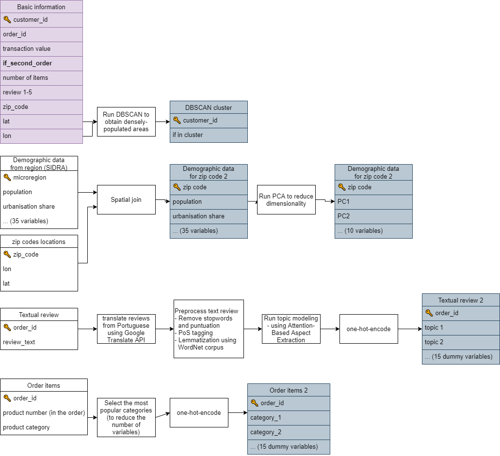
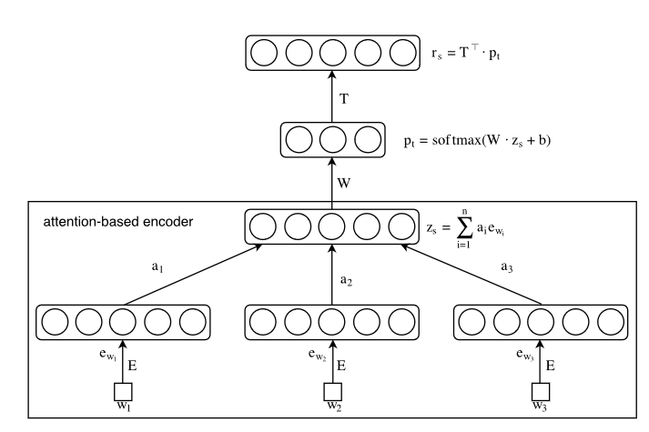

```{r include=FALSE}
knitr::opts_chunk$set(echo=params$echo)
```

<!-- TODO: *W części 04 też przyda się flow chart co będzie robione, na jakich danych i na jakie pytania odpowie.* -->

## Introduction {-}

The methodology used in this study can be divided into 3 broad categories:

- Machine Learning Modeling methods - choice of model, cross-validation, upsampling, etc.
- Preprocessing applied to the variables present in the dataset
- Methods used for variable selection.

In the following sections I have described these categories in greater detail.

## Modeling methods

In this study, I have compared Logistic Regression and XGBoost models. The reasons for the choice of these particular models are as follows. Logistic Regression is relatively simple and explainable and was used in the task of churn modeling in previous studies [@nie2011credit; @dalvi2016analysis]. On the other hand, the XGBoost model was shown to give superior performance in all kinds of modeling using tabular data, also in the context of churn prediction [@gregory2018predicting]. It can also learn non-linearities and interactions between the variables on its own, contrary to LR where such features should be introduced to the model manually. 

Regarding cross-validation, I have used a simple train-test split of the dataset, with 70% of the observations belonging to the training dataset. On the training dataset, I have searched for optimal hyperparameters using 2-fold cross-validation on the training dataset. I have defined search space simply as a grid of all possible combinations of the hyperparameters. 

One important problem with this dataset is its very high target classes imbalance. Only 3% of the customers have decided to buy for the second time. To handle this issue, I have used upsampling of the minority class on the training dataset to obtain equal class proportions. Also, the choice of an appropriate metric to optimize is very important in an imbalanced dataset, as some metrics (like accuracy) are very biased in these cases. That is why I have decided to optimize the Area-Under-Curve metric, as it weights the performance of the minority and majority classes equally.

## Features preprocessing

In this study I have separated 3 groups of variables analyzed:

- behavioral (first transaction) features
- location features
- perception features.

On the diagram below a summary of preprocessing applied to all the parts of the dataset is presented. All the tables on the left-hand side are coming directly from Olist (4 tables) and Statistical Office sources (1 table - demographic data). The purple table is the primary one, the features from this table were combined with all the remaining sets of variables. The final tables after preprocessing each of the parts of the dataset are shown in gray. In the modeling phase, I have used a simple join of the basic table, and the remaining ones, separately from each other (basic information + order items, basic information + DBSCAN cluster, etc.).




### Behavioral features

Behavioral predictors can be defined as the variables quantifying previous actions of the customer. In most cases, this narrows down to the data about previous transactions and previous interactions with the company. Behavioral information about customer's interactions with the company was shown to be an important predictor in churn prediction (for an overview see @schmittlein1994customer). 

The widest range of behavioral variables up in churn prediction setting up to date was used by @buckinx2005customer. Besides 7 variables meant for encompassing frequency and monetary value, they also included variables indicating total spending divided by categories of the products available in an e-commerce shop. They found that all 3 categories of variables are statistically significant and bring improvement to the model's predictions. In particular, they found that bigger customer spending leads to the customer's desire to keep being a company's customer. Besides that, the categories that the customer has been buying in the previous purchases also have been shown to influence the customer's decision to stay. This is in line with findings from the previous studies [@athanassopoulos2000customer; @mozer2000predicting]. One possible explanation of churning based on categories bought suggested by @mozer2000predicting is that the satisfaction of purchasing a particular category is low - no matter if because of the high price or the low quality of the product bought.

In this study, from the category of behavioral variables, I have included information about the monetary value of the first purchase, delivery cost, number of items bought and categories of items that the customer bought. The specification of the behavioral variables used is slightly different from previous studies. Namely, I have excluded Recency and Frequency from the set of predictors. The reason is that in this study I am interested in predicting customer loyalty just after the first purchase. Because of that, these variables require some time to pass since the purchase and can't be calculated or used.

In the case of the company analyzed in this study, the products sold belong to 74 distinct categories. At the same time, the top 15 categories account for 80% of all purchases. Because of potential problems with generalization and slower model training, I have decided to bin the least popular ones as a new category "other". Then, I have used the one-hot-encoding approach to create a numeric representation, with the "other" category set as a base level. ^[Because in one order there can be multiple product categories, it is not guaranteed that there will be only one "1" entry per each row as in the classical one-hot-encoding method.]

To assess the validity of previous studies' findings regarding the behavioral variables in an e-commerce retail context, I have tested 2 hypotheses. (1) **The amount of money spent on the first purchase positively influences the customer's probability of buying for the second time.** (2) **Categories of products bought by the customer can influence the customer's probability to stay with the company.**

### Location features 

<!-- #### Ways of including spatial dimension to the churn prediction -->

@lee2013neighborhood argue that customer location and its neighborhood is an important factor to consider in CRM analyses, even in e-commerce settings.

There are multiple ways to include spatial dimension in modeling. In this study, I have analyzed 3 broad approaches that were used in previous studies:

- directly including location variables (geographical coordinates, zip code, region indicator dummies, etc.)
- analyzing neighborhood that the customer resides in (demographical statistics about the region)
- classifying customers by living in an urban or rural area

#### Direct inclusion of spatial variables {-}

To the best of the author's knowledge, no studies on churn prediction conducted before included raw geographic coordinates in the model formulation. Rather, usually dummy variables indicating the administrative regions were used. There is no consensus on whether such data can improve the predictions. @verbeke2012new argued that "the number of times a customer called the help desk will most probably be a better predictor of churn behavior than the zip code". On the other hand, @buckinx2005customer showed that such dummies were significant in the case of the Neural Network model, but not in Random Forest. Also, @long2019new found that these dummies are significant. However, in that case, a different spatial extent was analyzed - the region variables indicated countries rather than postcodes.

@de2019impact used geolocation data in the context of churn prediction for an insurance company. They took a different approach to operationalizing customer location. Instead of including dummies indicating the customer's region, they calculated the distance between the customer and the closest insurance agent. Such variable was significant.

In this study, I have simply included longitude/latitude data about each customer directly to the model formulation. This is to assess **if the propensity to churn can be explained by customer location**.

#### Geodemographics {-}

Geodemographics is the "analysis of people by where they live" [@harris2005geodemographics]. In this paradigm, it is assumed that people living in the same area share similar characteristics, like their social status, income, etc.

As pointed by @singleton2014past, geodemographic features were mostly used in the studies regarding public sector areas, mainly public health and law enforcement. Publicly available research in the usage of geodemographics in the context of marketing, or specifically churn prediction is almost non-existent. This has its reasons in the confidential nature of research done in individual companies [@webber2004targeting]. The only publicly available study was conducted by @zhao2005customer. They found that geodemographic features were significant in the churn prediction model.

A hypothesis I would like to check is **if the social structure of the customer's environment can serve as a valuable predictor of churn tendency.**

In total, I have included 35 demographic features for the microregion from which the customer is - age structure, percentage of the population in an urban area, income structure, number of immigrants. These features were obtained from the Brazilian statistical office^[Joining the data coming from this source and main transaction dataset proved to be challenging. The details of such spatial join are presented in Appendix A.]. 

Geodemographic dimension in this study is relatively high dimensional. At the same time, one would expect that the information can be somehow compressed because lots of the variables represent very similar concepts (for example there are 20 variables encoding only age structure). 
Because of that, I have decided to process this part of the dataset using Principal Components Analysis. This can potentially bring some improvements in the process of Machine Learning modeling, as training the model on a smaller, compressed dataset is more resource-efficient and at the same time was shown to improve the modeling results in some cases [@howley2005effect].

<!-- ; @dutkiewicz2021heisenberglimited]. -->

One decision regarding PCA transformation is whether to use a standard version or the one with rotated loadings [@corner2009choosing]. The trade-off between these two methods is that the rotated loadings version allows for an interpretation of the loadings but is less optimal in a sense that the variance along each loading is not maximized. I have decided that a standard one would be more suitable in the case of this study because the explainability of the input variables to the model is not as important as correctly representing the features in lower-dimensional space and thus preserving as much valuable information as possible for the modeling phase.

#### Rural vs. urban customer location {-}

Generally, there is a consensus among researchers that there is a difference in customer behaviors between rural and urban areas [@sun2004consumption]. In particular, a couple of studies in the FMCG sector have found that rural customers tend to be more loyal to the previously chosen company [@jha2003understanding; @sharma2021impact]. The potential reason for such finding provided by the authors is a smaller choice of other options in the rural shops compared to urban ones. However, up to date, there were no studies that were meant to assess the differences between customer loyalty in urban and rural areas but aimed at the e-commerce sector. The findings from the FMCG sector do not have to translate directly, as in an online setting the customers are generally not limited by the availability of the brand in their area. 

A hypothesis worth checking is **if the tendency to churn is dependent on whether the customer is living in a densely populated area.**

There are 2 possible ways to conclude if a particular customer is living in an urban or rural area. One is simply checking if the customer's coordinates are inside the city's administrative boundaries. Such an approach does not guarantee that this customer is really living in a densely populated area - because of the fact that administrative boundaries do not have to reflect actual boundaries (for example, because of fast suburbanization spilling to previously village areas).

Another way is inferring the population density in the area from empirical data. This way, one gets more reality-reflecting densely populated areas classifications. As was shown before in the dataset review, the number of customers per microregion highly correlates with population density in this area. Because of that, it can be argued that also in a smaller scale of analysis than microregions such correlation will be also evident. This leads to a conclusion that the company's customers' locations can be used as a proxy for population density, so it can be used for classifying densely and sparsely populated areas. 

In this study, I have used the Density-Based Spatial Clustering with Noise (DBSCAN) algorithm for the task of rural vs. urban areas classification. This clustering algorithm besides assignment to a particular cluster can also detect noise points. Because of that, the assignments have a natural interpretation. When the point belongs to any cluster it means that this customer is living in a densely populated area, while the points decoded by DBSCAN as noise are the customers living in more isolated places.

DBSCAN has 2 parameters to be decided before running the algorithm. These are the minimal number of points lying close to each other that are needed to constitute a cluster (*k*), and maximal distance, at which one considers the points to lay close to each other (*epsilon*).
A typical rule-of-thumb for deciding k and epsilon parameters is to first set k, and then plot k-nearest-neighbors' distances. Epsilon should be then decided based on *elbow point*, where the line is bending. However, when the features are geographical coordinates, epsilon is actually a physical distance between two locations. That is why one can set what should be more reasonable criteria for constituting clusters. 

In my work, I have decided that the minimal number of customers in the cluster is 100, and the maximum distance between the customers in one cluster is 50 kilometers. For the location of Brazil on the geoide, this transfers roughly to epsilon=0.2. 

### Perception features

<!-- #### Definition of the category -->

Customer perception of the company is considered an important factor driving customer loyalty [@kracklauer2001mutual].
Unfortunately, customer satisfaction is an immeasurable variable. Different proxies can be however included in the model, and usually gathering such data requires conducting customer surveys. @churnthesis specifies possible dimensions of such survey: "overall satisfaction, quality of service, locational convenience and reputation of the company". 

In e-commerce settings, an industry-standard is to provide a way for the customers to express their opinions about the purchase [@lucini2020text]. The company has to decide, in how structured way it would like to collect them. Text reviews can provide way richer information about the customer experience, as they are not limited to describing the experience in predefined dimensions. On the other hand, extracting meaningful information from sometimes millions of text reviews is a very challenging task to which no universally acclaimed solutions exist [@felbermayr2016role; @zhao2019predicting]. 

In the case of the dataset analyzed in this study, there are 2 proxies of customer perception available. One is a customer review on a scale from 1 to 5. The other is a textual review of the purchase. Using numeric review in the modeling is straightforward and doesn't require further explanation. In the next sections, I have described the preprocessing of textual reviews in greater detail.

#### Ways of analyzing textual reviews {-}

As stated before, text reviews can potentially serve as a rich source of information about customer satisfaction.
Although text mining for customer reviews in general is an active field of research, usage of such information in the context of churn prediction is way less covered. To the best of the author's knowledge, only 2 studies used the data from textual reviews for churn prediction. @DECAIGNY20201563 have used text embedding approach, while @9325646 - simple tf-idf technique. 

@lucini2020text specifies 2 natural language processing areas that can be used to extract insights from customer reviews, namely topic modeling and sentiment analysis. The first one is meant to answer the question "what the review is about?", while the second - "what is the perception contained in this review?". A combination of these two dimensions can help answer the question, which areas of customer experience are rated positively, and which need improvement.

In the case of this study, I have focused only on extracting the topic from the review. The reason is that information about whether the experience of the customer was positive is already contained in a numeric review. **My hypothesis is that both the numeric review, as well as topic of the textual review can be useful predictors of customer loyalty.**

<!-- @zeroual2018data -->
<!-- @athanassopoulos2000customer  -->
<!-- https://www.jmir.org/2021/1/e22184/ - topic modeling + RNN -->

#### Previous research in topic modeling {-}

<!-- ##### LDA, dlaczego słabe -->

Undoubtedly the most popular model for inferring the topic of a text is Latent Dirichlet Allocation [@blei2003latent]. The method is based on assumption that each document is a mixture of a small number of topics. At the same time, each topic can be characterized by a distribution of words frequency.

@hong2010empirical argue that short texts (as in the case of customer reviews) comprise of a very small amount of topics, usually only one. Because of that, LDA should not be used in such settings as its assumptions are violated. This claim is supported by an empirical study of short texts from Tweeter, in which LDA has failed to find informative topics.

<!-- ##### Movie group process -->

The drawbacks of LDA in the setting of short texts were addressed by @10.1145/2623330.2623715 . They used the Gibbs Sampling algorithm for the Dirichlet Multinomial Mixture model, which is an improvement over typical LDA. The main difference compared to the basic algorithm is an introduction of assumption, that each text comprises only one topic. The authors show that this algorithm provides superior performance compared to the basic LDA technique in the context of short texts. 

<!-- ##### Aspect attention -->

More modern approaches to topic modeling were also developed recently. A milestone in the whole NLP field was inventing an efficient way to embed words in a vector space while preserving their meaning, namely word2vec [@mikolov2013efficient]. On a basis of this method, @he2017aspect presented an Attention-based Aspect Extraction^[Words "Aspect" and "Topic" are often used interchangeably in the NLP literature] model. At first, words embedding using the Word2Vec model is created. After that, for each text in the corpus, attention weight for each word is computed using a neural network with an attention layer. Then, an embedding of the whole sentence is created by computing an average for all words embedding. The words are weighted by their attention weights. The last step of the procedure is creating an encoder-decoder model for learning sentence aspect embedding. The reconstruction of the sentence is the linear combination of aspect embeddings, and aspect embeddings are learned by mapping sentence embedding to a lower-dimensional space.

Other studies using the embedding technique were conducted by @tulkens-van-cranenburgh-2020-embarrassingly and @ijcai2019-712. In both studies, the algorithms presented outperformed the LDA method in the task of short text topic modeling.

<!-- @tulkens-van-cranenburgh-2020-embarrassingly, who proposed a new type of Attention mechanism, meant especially for the aspect recognition task. It's an advantage over the one presented by [@he2017aspect] is that instead of a complex neural network, a way simpler approach based on Radial Basis Function kernel is used. Another work presenting a new attention mechanism is by @ijcai2019-712 - they use a use a Encoder-Decoder framework with a *Semene Attention* mechanism. (skrócić do 1 zdania) -->

#### Text reviews preprocessing in this study {-}

In this study, I have tried and evaluated 3 algorithms for topic modeling:

- Latent Dirichlet Allocation [@blei2003latent] - because it is a go-to standard for topic recognition.
- Gibbs Sampling algorithm for the Dirichlet Multinomial Mixture [@10.1145/2623330.2623715] - as this method is an improvement over LDA, meant especially for short texts. This is true in this case, as most of the reviews are just a couple of words long.
- Attention-Based Aspect Extraction [@he2017aspect] - this method is also meant for short texts, and at the same time, it uses the most modern, state-of-the-art NLP techniques. Besides that, in the original paper, the authors worked in a similar domain of internet text reviews. 

The working of each of the methods is described in the following sections.

#### Methods working description

Latent Dirchlet Allocation is a generative statistical model. Its main assumptions are as follows:

-   Consider a text corpus consisting of $D$ documents. Each document D has $N$ words, that belong to the vocabulary $V$. There are $K$ topics.
-   Each document can be modeled as a mixture of topics. For document $D$, it can be characterized by a distribution of topics $\theta_D$, that is coming from Dirichlet family of probability distributions. Each topic has its distribution of words $\varphi_k$, that is coming from Dirichlet family. Then, a genrative process aimed at obtaining a document D of length of $N$ words $w_{1,...N}$ is as follows:
-   To generate word at a position $i$ in the document:
    -   Sample from the distribution of topics $\theta_D$, and obtain assignment of word $w_i$ to one of the topics $k=1,..,K$. This is to obtain information, from which of the topics the word should be sampled.
    -   Sample from the distribution of words in topic $\varphi_k$, and obtain the word to be inserted at position $i$.

The parameters of $\theta_D$ for each document D, as well as $\varphi_k$ for each of the topics, should be learned using some method of statistical inference. Most of the practical implementations of the algorithm are based on Expectation Maximization method. This iterative approach is aimed at finding the local maximum of Likelihood function.

Second method, Gibbs Sampling algorithm for the Dirichlet Multinomial Mixture, is very similar to LDA approach. However, one important difference in assumptions is present, that is, **each document has words only from one topic**. This assumption is changed, because the authors claim that usually in the case of short texts, only one topic is present. This leads to the following generative process:

To generate a document $D$:

-   Sample from the distribution of topics $\theta_D$, and obtain assignment of the document to one of the topics $k=1,..,K$.
-   Sample all words from the topic distribution $\varphi_k$

Attention-Based Aspect Extraction takes a very different approach to topic modeling compared to the aformentioned methods. It is not based on a statistical model, but rather on neural network modeling. 



The following steps describe the model architecture provided in the fig. .. For each document from the corpus:

1.  Calculate word embeddings $e_{w_1}, e_{w_2}, e_{w_3}$ with dimensionality $d$ for each of the words from the vocabulary based on the whole corpus. From this point, one obtains an assignment of the word $w$ to the feature vector $e_w$ in the feature space $R^d$.
2.  Obtain document embedding $z_s$. This is done by averaging the embeddings of all the words from the document. Average is weighted by attention weights $a_1, a_2, a_3$ given to each of the words. These weights are to be estimated during the model training, and can be though of as a probability, that the particular word is a right word to focus on to correctly infer the main topic of the document. It is worth noticing that document embeddings share the same feature space as the word embeddings.
3.  Then, calculate $p_t$ using softmax non-linearity and linear transformation $W$. This vector $p_t$ is of the same dimensionality as the number of aspects to be learned, and can be thought of as a representation of the probability, that the sentence is from the particular aspect. By taking the biggest probability of this vector, one can obtain the assignment to the particular topic.
4.  Increase the dimensionality of vector $p_t$ to the original dimensionality $d$ by transforming it with aspect matrix $T$. Vector $r_s$ is obtained.
5.  The training of the model is based on minimising the reconstruction error between the vectors $z_s$ and $r_s$.

The authors claim that this method is able to capture better, more coherent topics than LDA and its improvements. The main specified reason is as follows. In LDA, all of the words are assumed to be independent. Thus, information about the "closeness" of the meanings of words is lost, and has to be learned by assigning similar words to the same topics. This is a hard task that LDA is not optimized to. On the contrary, by using the words embedding approach, the relationships between the words are known apriori by the model and can be built upon. For example, even without knowing the topics present in the corpus, one would expect that the words "cow" and "milk" should indicate the same topic with high probability. 

Various preprocessing steps were needed to apply all 3 aforementioned algorithms:

- **Translation of the reviews from Portuguese to English.** Olist e-commerce store is operating only in Brazil. That is why most of the reviews are written in Portuguese. I have used Google Translate API to change their language to English. This is to facilitate not only understanding the reviews, but also the NLP tools available for the English language are more advanced than for other languages.
- **Removal of stopwords and punctuation.**
- **Lemmatization** using WordNet lemmatizer [@wordnet] combined with Part-of-Speech tagger. This step is needed to limit the number of words in the vocabulary. Thanks to the Part-of-speech tagger, the lemmatizer can change the form of the word on a more informed basis, and thus apply correct lemmatization to more words. 

Later steps of the preprocessing were different for each of the algorithms.

For LDA and Gibbs Sampling, only **converting lemmatized reviews into vector format** was needed. In the case of LDA, the count-vectorizing approach was applied, with removing of words that appeared in less than 0.1% of reviews. In the case of Gibbs Sampling, the same preprocessing is done internally by the training function from the package. In both of these cases after vectorization, one should obtain a matrix with n rows and k columns, where n is the number of observations in the original dataset, while k - the size of the vocabulary. 

Very different preprocessing was required in the case of Attention-Based Aspect Extraction. The neural network architecture proposed by the authors requires simply lemmatized reviews in a textual format as the output. Then, one of the layers of the network is meant to embed the currently preprocessed word. These embeddings are not learned during the network training, they should be trained beforehand instead. The authors of the paper propose the Word2vec technique [@mikolov2013efficient] for learning embeddings. Following their guidelines, I have used this method, setting the dimensionality of the vector space to 200. I have also applied the word window of 10. After applying word2vec on this dataset, I have obtained the matrix with m rows and 200 columns, where m stands for the number of words in the dataset, and 200 is the dimensionality of the vector space chosen as a hyperparameter. 

Concerning topic models training, I have searched for optimal hyperparameters for all 3 models based on grid search. For LDA, I have tested a varying number of topics that the model has to learn (3, 5, 10, and 15). For GSDMM, 2 parameters influence topics coherency in each "cluster". I have run the algorithm for all 16 combinations of both parameters chosen from the values 0.01, 0.1, 0.5, and 0.9. For Attention-Based Aspect Extraction, I have manipulated the number of topics to learn, from the values 10, 15. Unfortunately, as this last model takes a very long time to run (around 3 hours per one set of hyperparameters), I have limited the number of hyperparameters checked compared to the LDA model. 

The evaluation of topic extraction is a hard task, as no model-agnostic metrics that can be compared between different models exist. The only reasonable method is human inspection. That is why after running every model I have verified the obtained topic for coherency (whether reviews inside one topic are similar) and distinctiveness (whether there are visible differences between modeled topics).


<!-- Olist e-commerce store is operating only in Brazil. That is why most of the reviews are written in Portuguese. I have used Google Translate API to change the language of them to English. This is to facilitate not only understanding the reviews, but also the NLP tools available for English language are more up-to-date and advanced. -->

<!-- In all 3 methods I have removed stopwords and punctuation from the text. Also, to limit the number of words in the vocabulary I have used lemmatization technique. This was done by WordNet lemmatizer [@wordnet]. To further improve the results, I have used Part-of-Speech tagger, and passed the tags of words to the lemmatizer. This way the algorithm can change the form of the word on a more informed basis, and thus apply lemmatization to more words.  -->

<!-- Second step of the preprocessing was converting lemmatized reviews into vector format. In case of LDA, count-vectorizing approach was applied. The words which appeared in less than 0.1% of reviews were dropped from the dataset. In the case of Gibbs Sampling the same preprocessing is done internally by the training function from python package.  -->
<!-- In both of these cases after vectorization one should obtain a matrix with n rows and k columns, where n is number of observations in the original dataset, while k - size of the vocabulary.  -->

<!-- Very different preprocessing was required in the case of Attention-Based Aspect Extraction. The neural network requires simply lemmatized reviews in textual format as the output. Then, one of the layers of the network is meant to embed the currently preprocessed word. These embeddings are not learnt during the network training, they should be trained beforehand instead. The authors of the paper propose Word2vec technique [@mikolov2013efficient] for learning embeddings. Following their guidelines I have used this method, setting the dimensionality of the vector space to 200. I have also applied the word window of 10.  -->

<!-- After applying word2vec on this dataset, I have obtained the matrix with m rows and 200 columns, where m stands for number of words in the dataset, and 200 is the dimensionality of the vector space chosen as a hyperparameter.  -->
<!-- One should bear in mind that count-vectorization works on review level, while word2vec - on words level. This means that after applying word2vec model to 1 review, one would obtain the same number of outputs as the number of words in the review. This is why it is impossible to use word2vec to preprocess the dataset and then use LDA or Gibbs sampling without some way to convert couple of vectors into one.  -->

<!-- I have searched for optimal hyperparameters for all 3 models based on grid search. For LDA, I have tested varying number of topics that the model has to learn (3, 5, 10 and 15). For GSDMM, there are 2 parameters that influence topics coherency in each "cluster". I have run the algorithm for all 16 combinations of both parameters chosen from the values 0.01, 0.1, 0.5 and 0.9. For Attention-Based Aspect Extraction, I have manipulated with the number of topics to learn, from the values 10, 15. Unfortunately, this last model takes a very long time to run (around 3 hours per one set of hyperparameters), I have limited the number of hyperparameters checked compared to LDA model.  -->

<!-- Unfortunately, the evaluation of topic extraction is a hard task. The only reasonable method is human inspection. That is why after running every model I have verified the obtained topic for coherency (whether reviews inside one topic are similar) and distinctiveness (whether there are visible differences between modeled topics). -->

<!-- ## Reviews analysis -->

<!-- The algorithm used by the authors is called Movie Group Process. Short introduction to this algorithm is included below. -->

<!-- Imagine a movie discussion group. There are k tables, and the goal is to assign students to tables according to their similar movie taste. There are 2 preference parameters set for each student: -->

<!-- 1. Choose a table with students having similar movie taste. This is meant to introduce homogeneity of the clusters.  -->
<!-- 2. Choose a table with more students in this group. This rule is meant to improve completeness - so to the clusters have a reasonably high number of members. -->


<!-- In recent years completely new approaches to Natural Language Processing emerged, thanks to improvement in the area of Neural Network algorithms. Two approaches are especially important as they serve as a baseline for the most recent findings in aspect (topic) recognition area. These two are word vector representations and attention mechanism. A short introduction of these two methods is presented in the section below. -->

<!-- In 2013, word2vec [@mikolov2013efficient] was presented. The goal of this method is to learn a meaningful vector representation of each word in a corpus. Word2vec’s approach is to train a model that predicts all of the neighboring words for every occurrence of every word in an entire body of text (a corpus). -->

<!-- Intuitively, suppose that the model needs to learn embeddings for 3 words: "king", "queen", "orange". The points in the embedding space for the first two words should lay in the proximity, while "orange" should be further. Word2vec approach is to look at the probability, that given word should be placed in particular place in the sentence, given the neighboring words. Suppose we have an incomplete sentence "XXX were usually very rich in the past". Word2vec tries to predict what XXX should be. From the corpus it should understand, that "king" and "queen" are more probable than "orange", that is why puts the embeddings closer. -->

<!-- Creating word embeddings usually serve as a preprocessing phase for next analysis steps, as with the data in numeric form one can use all tools that conventional data analysis has to offer, not being limited anymore by the complicated nature of textual data. -->

<!-- Another concept very helpful in the aspect recognition domain is attention mechanism [@chorowski2015attention]. It is based on attention mechanism in psychology. When a human is trying to understand any content (visual, textual etc.) she is not using all content in the same extent, but only the relevant parts. For example, when a car driver is making a decision whether to cross an intersection, from all the visual signals that she obtains at the moment, the most important (and the only one looked at) is whether the light is red or green.  -->

<!-- This concept can be very useful in the area of aspect prediction, as usually only couple of words from the whole sentence show the topic of it.  -->


<!-- An important source of knowledge about e-commerce customers are textual reviews. They can serve as a rich source of feedback for what in the shop or product is liked and what needs change. Also, in the textual reviews one can get to know customer's opinions way better then using other types of feedback, for example 1-5 rating of a purchase. With these advantages, they come at the expense of increased complexity of such analysis. A big challenge is to extract meaningful information from this type of highly unstructured data. -->

<!-- Two most important types of text mining in text reviews is *sentiment prediction* and *topic mining* (in the context of reviews also often called *aspect mining*).  -->
<!-- Topic modeling is particularly challenging, as usually one does not have a annotated dataset with topics assigned to each text. That is why an unsupervised approach usually has to be used. -->


## Variables selection methods

To summarize, from variable preprocessing I have obtained these 6 sets of features:

- basic information - the value of the purchase, geolocation in raw format lat/lng, the value of the package, number of items in the package, review score (6 variables)
- geodemographic features for the region from which the customer is - age structure, percentage of the population in an urban area, income structure, number of immigrants (35 variables)
- geodemographic features transformed using PCA - (10 variables/components)
- indicator whether the customer is in an agglomeration area obtained from DBSCAN on location data (1 variable)
- product categories that the customer has bought in the purchase (15 dummy variables)
- main topic that the customer has mentioned in the review (15 dummy variables).

An approach used by @churnthesis for an assessment of the new feature previously untested in the churn prediction was to compare 2 models, one containing only basic RFM features, and the other RFM features and also this new feature. I have used a similar approach. Namely, first I have included basic features that didn't require any preprocessing. This model served as a baseline. Then, for each of the sets of features that I have computed, I have estimated a model containing these features + basic features. Lastly, I have created one model containing all the variables. This resulted in the following 7 feature sets tested:

- basic features
- geodemographic + basic features
- geodemographic with PCA + basic features
- agglomeration + basic features
- product categories + basic features
- review topic + basic features
- all variables - (with geodemographic features transformed with PCA) ^[I have not run the model containing all variables with demographic features without PCA preprocessing. There are 2 reasons for that - one is that number of variables in this set is very big, which poses performance reasons - model training simply would take a very long time. The other is that the model with only included PCA demographic variables performed better than the full set of variables.]  

### Automatic feature selection - Boruta algorithm {-}

To test if the approach with including whole sets of features to the training set is an optimal one, I have also tested one method of automatic feature selection, namely a Boruta algorithm [@kursa2010feature]. It is widely popular among machine learning practitioners [@kumar2017empirical]. The algorithm belongs to the category of wrapper feature selection algorithms, and a Random Forest algorithm is usually used as a machine learning method. It works as follows. At first, all features from the original dataset are randomly permuted. This way, one obtains a dataset with close-to-zero predictive power. Then, the resulting features are added to the original dataset and the Random Forest model is trained. 

This model has a built-in feature importance measure, which is usually Mean Decrease Impurity (MDI). After running the model, for each of the original features, MDI is compared against all MDI scores for shadow features. If for any original variable the score is less than the one from any of the shadow features, the variable gets a "hit". 

The above procedure is repeated for a preassigned number of iterations. Finally, important features that should make it to the final model are the ones that obtain fewer hits than preassigned value. 

After gaining knowledge about the variables that should make it to the model, I have trained the XGBoost classifier using these features. The rest of the fitting procedure (cross-validation, up-sampling, hyper-parameters, etc.) stayed the same as in the rest of the approaches.  

One should have in mind that the Boruta algorithm is very time-consuming. The minimal number of runs recommended by the method authors is 100, and one run consists of fitting a Random Forest model to the whole dataset with doubled number of features (because of added shadow features). In the case of this analysis, model computation took about 12 hours on a modern laptop. Although other wrapper algorithms also require an iterative fitting of the model, they usually start with fitting the model to one variable, in the next iteration to 2, and so on up to k features. On the other hand, the Boruta algorithm in each iteration fits the model to 2*k features (original and shadow features).

<!-- ## Śmieci -->

<!-- https://www.sciencedirect.com/science/article/pii/S0377221703009184?casa_token=6GS1hqD0KcAAAAAA:4p02d0H6wlfEDACtjCUYfXB_5ABUmf2QqD9RILvjbNYHgLF6S3tnAT2VjqJXLzJFxI1oVK9GTQ -->

<!-- Dobrze wytłumaczone co może powodować które kategorie -->
