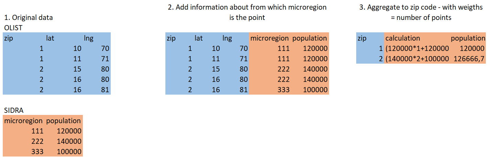

```{r include=FALSE}
knitr::opts_chunk$set(message = F, warning = F, echo=params$echo, fig.width = 4, fig.height = 2.5, cache = T)
```

```{r cache=F}
library(readr)
library(tidyverse)
library(stringr)
library(here)
```

## Appendix A - Spatial join of census data to the main dataset

Joining of the data coming from Brazilian census and the e-commerce company soures proved to be challenging. There were multiple reasons for that:

- In the e-commerce dataset the spatial dimansion is encoded mainly in a form of ZIP codes, while in demographic dataset - in a form of microregions (a Brazilian administrative unit).
- The boundaries of zipcodes and microregions do not align.
- The customer's geolocation data has 3 columns - zip code and lat/lng coordinates. For each zip code there are multiple entries for coordinates. This probably means that the company has exact coordinates of each of their customers, but decided to not provide exact customer-location mapping in public dataset for anonimisation reasons. Because of that the boundaries of zip codes cannot be specified exactly and one has to rely on the particular points from this zipcode area.

My approach to the challenge of joining these two data sources was as follows: 

1. For each of the points in  geolocation dataset, establish in which microregion it is. Join the dataset for that region to OLIST geolocation dataset.
2. Group the dataset by zip code and calculate the mean of each of the features in the dataset. In this case this mean would be a weighted mean (with weight in form of "how many customers are in this area?")




## Appendix B - reviews topics

```{r}
flextable_format <- function(x){
  flextable::theme_box(x) %>%
  flextable::font(fontname = 'Times New Roman', part = 'all') %>%
  flextable::fontsize(size = 12, part = 'all') %>%
  flextable::autofit() %>%
  flextable::set_table_properties(layout = "autofit") 
  
}

set_caption2 <- function(table, x, number = NULL){
  if (is.null(number)){
    flextable::set_caption(table, sprintf('Table .. . %s',x),style = 'table_format')
  } else {
    flextable::set_caption(table, sprintf('Table %s. %s',number, x),style = 'table_format')
  }
}

```


```{r}
topics_table_to_paper <- read_csv(here('topics_table_to_paper.csv'))# %>%
  # mutate(`Example reviews` = str_replace_all(`Example reviews`, '\\n', '||||'))

topics_table_to_paper %>%
  separate(`Example reviews`,sep = '\\n', into=c('a1', 'a2', 'a3'))%>%
  pivot_longer(4:6) %>%
  mutate_all(function(x) ifelse((x != lag(x)) | row_number()==1, x, NA)) %>%
  select(-name) %>%
  rename(`Example review` = value) -> topics_table_to_paper2

load(here('run_all_models_cache/topics_second_order_percentages.Rdata')) 

topics_second_order_percentages %>%
  filter(topic != 'topic_nan') %>%
  separate(topic, c('a', 'b'), '_') %>%
  mutate(b = as.numeric(b)) %>%
  select(b, percent_second_order) %>%
  rename(`Topic no.` = b) %>%
  mutate(percent_second_order = round(percent_second_order,3)) -> topics_second_order_percentages2

topics_table_to_paper2 %>%
  left_join(topics_second_order_percentages2) %>%
  select(1,2,3,5,4) %>%
  mutate(percent_second_order = ifelse(!is.na(percent_second_order), sprintf('%.1f%%', percent_second_order*100), "")) %>%
  mutate_all(function(x) ifelse(is.na(x), '', x)) %>%
  flextable::flextable() %>%
  set_caption2('Topics Inferred by Attention-based Aspect Extraction', 5) %>%
  flextable_format 

```


## Appendix C - table of lift values for selected quantiles


```{r }
load(here('data/output_lifts.Rdata'))

quantiles_to_show <- c(0.99, 0.98, 0.97, 0.96, 0.95, 0.9, 0.8, 0.7, 0.6, 0.5)
output_lifts %>% 
  select(-score_randomly, -performance_gain_over_randomly) %>%
  filter(fraction_of_customers %in% (1-quantiles_to_show)) %>%
  mutate_if(is.numeric, round, 2) %>%
  mutate(fraction_of_customers = scales::percent(fraction_of_customers,accuracy = 1)) %>%
  rename(`Fraction of customers` = fraction_of_customers,
         `No. customers in bin` = no_customers_in_bin,
         `Probability in selected bin` = score,
         `Lift` = lift_over_randomly
         ) %>%
  select(-prob_cutoff) %>%
  
  flextable::flextable() %>%
  set_caption2('Lift values for selected quantiles. General probability of buying second time is 3.29%.', 6) %>%
  flextable_format
```
